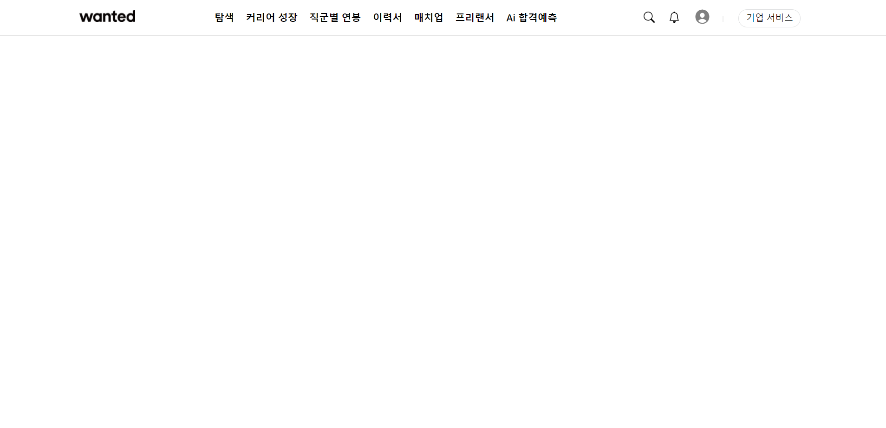
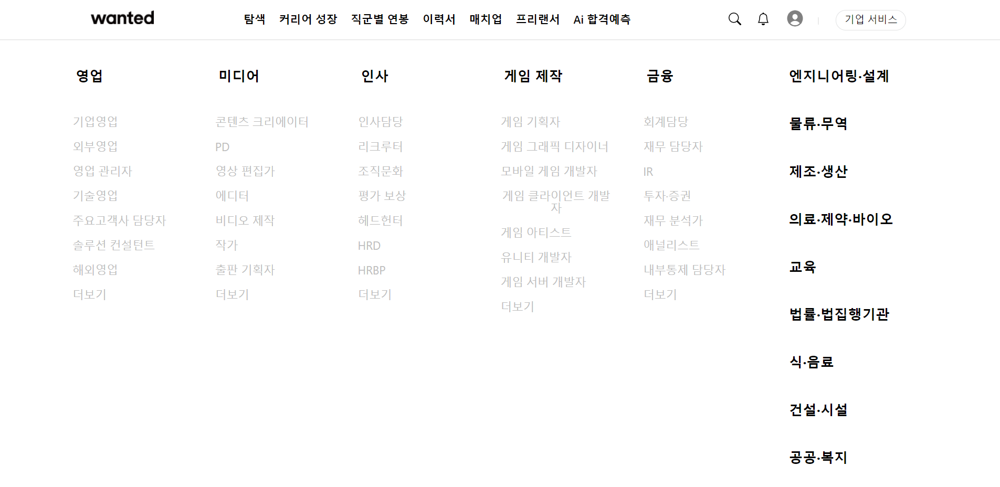
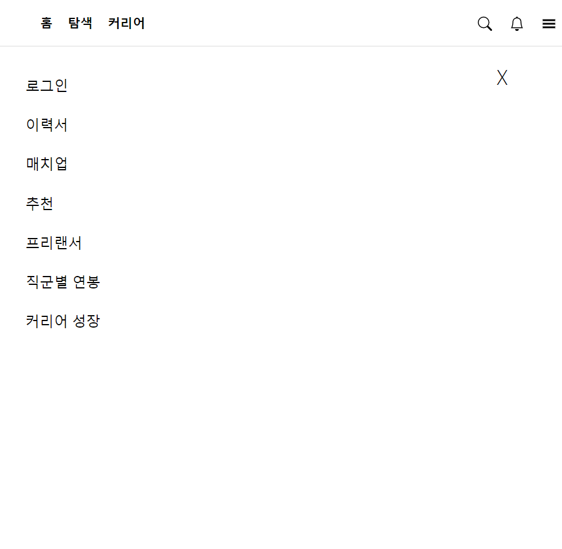

# 원티드 Nav Bar 클론 코딩

> 리액트를 사용하여 원티드 홈페이지의 Nav Bar를 클론 코딩하였습니다. 화면 크기에 따라 데스크탑 버전, 모바일 버전 다르게 보이는 반응형으로 구현했습니다.

#### 🛠 Tools

React, Javascript

#### 💻 Screens

- Navigation Bar

- '탐색'을 hover 했을 때 나오는 Dropdown

- 모바일 버전 메뉴 (햄버거 버튼을 클릭했을 때)

